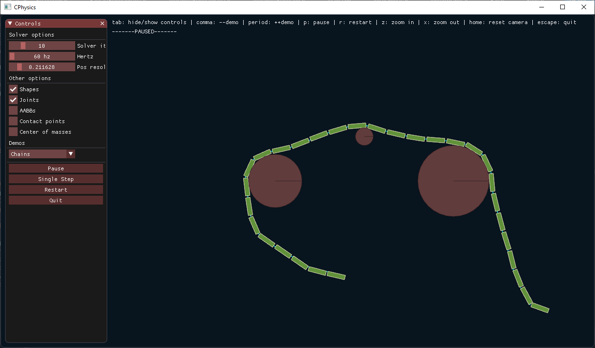
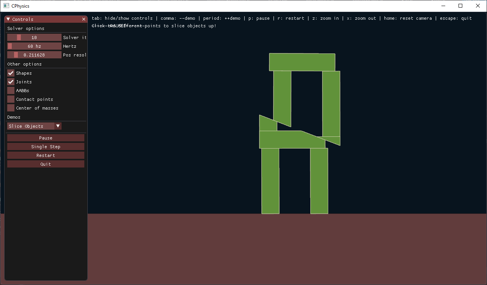

# CPhysics

CPhysics is a 2D physics engine written in C++ with the intention of being used in games. It it built with no third-party-library dependencies other than various standard c header files such as cmath.

The testbuild involves Dear imgui, cereal, glfw and glad dependencies for testing purposes.

## Screenshots

## Feature List
### Physics
- Rigid body dynamics
- Primitive joint constraints
- Momentum
- Friction
- Restitution
- Collision response (Sequential Impulses Solver)
- Stable object stacking
- Orbits
- Explosions
- Object slicing

### Collision
- AABB queries (Broadphase)
- One-shot contact manifolds
- Discrete collision detection
- Convex polygon and circle collisions
- Ray casting
- Position resolution handling

### Explosion types
- Proximity
- Ray casting
- Particle

### Testbed
- OpenGL for demo graphics
- Dear imgui for GUI
- Junit4 for junit tests
- cereal for serialization of settings

### Future features to implement
- Multi body shapes
    - collisions optimizations for said shapes
- Demos illustrating limitations within the engine
- Dynamic tree broadphase
- Continuous collision detection
- Island solution and sleep management
- Extra types of joints (eg Revolute, pulley)
- Fluid and soft body simulation

## Running testbed demo
- Clone/download the project onto your computer.
- Open visual studio.
- Click open local folder and navigate to the folder named "Rebuild of cphysics" that you cloned/downloaded in step 1
- Select this folder and open it in visual studio.
- Double click on Rebuild of cphysics.sln
- Select the debug options "release" and "x86". Run the program.

## Documentation
TO DO

## Future plans for the project
At the moment, I am focusing on other projects however I will be coming back to this at a later date to add improvements.

## License
CPhysics is developed by Hayden Marshall and falls under the [MIT license](https://en.wikipedia.org/wiki/MIT_License). See LICENSE.txt for more information.

## Credits
Dirk Gregorius and Erin Catto's online resources have proven instrumental in learning how to approach and construct a physics engine. Their gdc talks, documentation and numerous physics engine forum posts have been of great use and would highly recommend looking them up for anyone interested in learning about physics engines.
